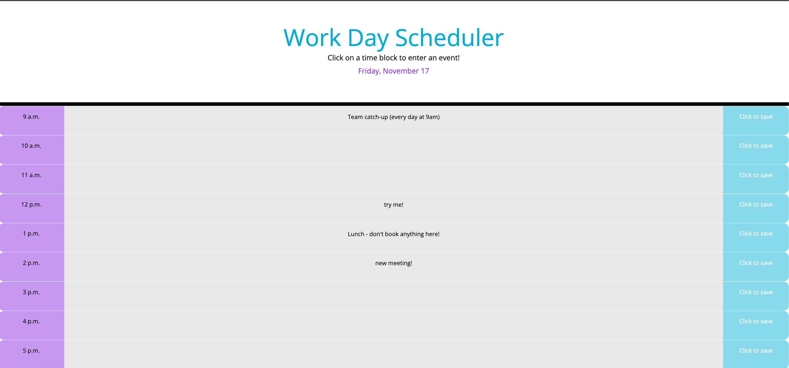

# Work Day Scheduler

## Description

The aim is to provide a simple calendar application that allows a user to save events for each hour of the day.

The current day and date is taken from day.js and is displayed in a user-friendly format.

It has a clean and polished user interface that is responsive, ensuring that it adapts to multiple screen sizes.

The project involved updating the HTML structure and writing the JavaScript code to give the application its functionality, with attention paid to use of day.js and styling for usability.

## Installation

n/a

## Usage

The current day and date are displayed at the top of the page when the user opens the scheduler.

Time blocks are shown underneath for each hour of a standard working day. Time blocks can be added to by adding additional rows in the index.html file.

Each time block is color-coded according to whether it is in the past, present or future to make it clear for users.

The user can enter an event (text) into a time block by clicking on it. That can be saved by clicking on the save button attached to that time block.

Once an event has been saved, it will persist when the page is refreshed.

Screenshot: 
Website: https://louise-elliott-work.github.io/work-day-scheduler

## License

This project is MIT licensed.

MIT License

Copyright (c) 2023 louise-elliott-work

Permission is hereby granted, free of charge, to any person obtaining a copy
of this software and associated documentation files (the "Software"), to deal
in the Software without restriction, including without limitation the rights
to use, copy, modify, merge, publish, distribute, sublicense, and/or sell
copies of the Software, and to permit persons to whom the Software is
furnished to do so, subject to the following conditions:

The above copyright notice and this permission notice shall be included in all
copies or substantial portions of the Software.

THE SOFTWARE IS PROVIDED "AS IS", WITHOUT WARRANTY OF ANY KIND, EXPRESS OR
IMPLIED, INCLUDING BUT NOT LIMITED TO THE WARRANTIES OF MERCHANTABILITY,
FITNESS FOR A PARTICULAR PURPOSE AND NONINFRINGEMENT. IN NO EVENT SHALL THE
AUTHORS OR COPYRIGHT HOLDERS BE LIABLE FOR ANY CLAIM, DAMAGES OR OTHER
LIABILITY, WHETHER IN AN ACTION OF CONTRACT, TORT OR OTHERWISE, ARISING FROM,
OUT OF OR IN CONNECTION WITH THE SOFTWARE OR THE USE OR OTHER DEALINGS IN THE
SOFTWARE.